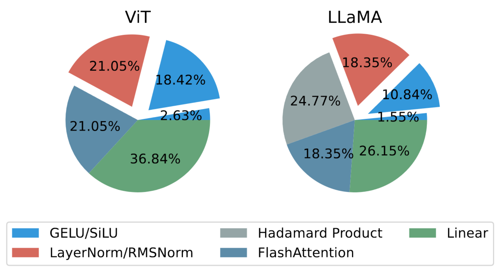
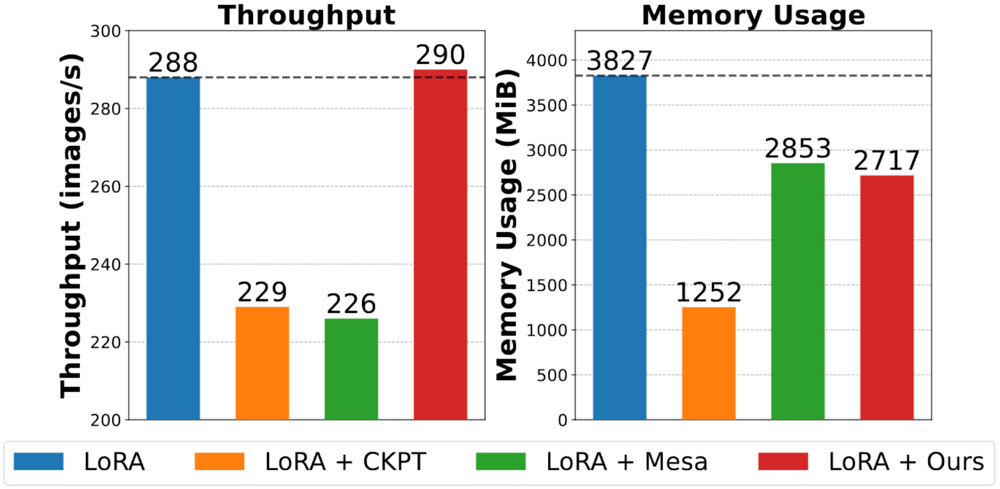

# LowMemoryBP

This is the official repository of our paper *"Reducing Fine-Tuning Memory Overhead by Approximate and Memory-Sharing Backpropagation"*[[paper]](https://arxiv.org/abs/2406.16282).
The Approx-BP and MS-BP techniques from our paper can **reduce a significant amount of GPU activation memory usage** during fine-tuning stage, **without slowing down the training throughput**.


Fig 1: The effect of our method on the activation memory usage. The separated parts are the reduced activation memory.


Fig 2: The comparision of the our method with gradient checkpointing and Mesa on the peak GPU memory usage.

Up to now, we have applied these techniques to two activation layers (GELU, SiLU) and two normalization layers (LayerNorm, RMSNorm).
The deduced low-memory counterparts are packed in the `lomem` torch-based package.

## Installation Guidance of `lomem`

As `lomem` is developped based on pytorch and CUDA, you should prepare a python3 environment with a CUDA-available pytorch installed.
And you should install a CUDA with the same version as that used to compile pytorch.
You can chack the version of pytorch by `pip show torch` and the version of CUDA by `nvcc -V`.

In our test, we use `torch_2.3.1+cu118` and `cuda_11.8` in the Ubuntu 20.04.6 LTS system with gcc version 9.4.0.

To install:
1. Make sure that `packaging` is installed (`pip install packaging`)
2. Make sure that `ninja` is installed (`pip install ninja`)
3. Clone this repository and enter this directory (`cd LowMemoryBP`)
4. Compile from source `pip install -e .`

## Usage and Features

`lomem` supports CUDA-device tensors with fp32, fp16 and bf16 dtype.

Firstly, import `torch` and `lomem`:

```python
import torch
import lomem
```

### Activation Layers

To use **ReGELU2** and **ReSiLU2**, just replace `torch.nn.GELU` and `torch.nn.SiLU` with `lomem.nn.ReGELU2` and `lomem.nn.ReSiLU2`, for example:

```python
# act_layer_1 = torch.nn.GELU()
act_layer_1 = lomem.nn.ReGELU2()

# act_layer_2 = torch.nn.SiLU()
act_layer_2 = lomem.nn.ReSiLU2()
```

ReGELU2 and ReSiLU2 have the approximate derivatives, so that they only store 2-bit-type activation momery.
The searching programs for ReGELU2 and ReSiLU2 are put in the [subdirectory](./search_act).
This technique can be viewed as 2-bit functional quantization of the derivative function, while remains the original function.
Therefore, they produce much less activation memory ($\times8$ for 16bit-type) than GELU and SiLU.

### Nomalization Layers

To use **MS-LayerNorm** and **MS-RMSNorm**, you should replace `torch.nn.LayerNorm` and `RMSNorm` with `lomem.nn.MSLayerNorm` and `lomem.nn.MSRMSNorm`, for example:

```python
# norm_layer_1 = torch.nn.LayerNorm(2048, eps=1e-8, elementwise_affine=False)
norm_layer_1 = lomem.nn.MSLayerNorm(2048, eps=1e-8)

# norm_layer_2 = RMSNorm(2048, eps=1e-8, elementwise_affine=False)
norm_layer_2 = lomem.nn.MSRMSNorm(2048, eps=1e-8)
```

MS-LayerNorm and MS-RMSNorm use the resigned formulas, storing the outputs into the activation memory and thereby sharing the activation memory with the following layers.
Therefore, they can be viewed as activation memory free layers.

**Note**:

1. ``MSLayerNorm`` and ``MSRMSNorm`` contain no affine parameters. When loading pretrained weights into the model with ``MSLayerNorm`` or ``MSRMSNorm``, you should manually merge the affine parameters of ``LayerNorm`` or ``RMSNorm`` into the following linear layers and maybe change the computational process to keep the mathematical consistency.

2. For unknown reasons, `torch.nn.functional.linear` (thereby `torch.nn.Linear`) can not share activation memory with `MSLayerNorm` or `MSRMSNorm`.
To address this problem, use our custom implementation to express linear operation (please refer to [this code](./experiments/vit_exp/model/partial.py)).

### Bool Packing

Apart from the implementations of low-memory activaiton layers and normalization layers, `lomem` provides useful functions to pack a bool-type tensor into a uint8-type tensor and restore it.

```python
shape = (11, 45, 77)
x = torch.rand(shape, device="cuda") > 0.5           # bool  (11, 45, 77)
z = lomem.functional.pack_bool_to_uint8(x)           # uint8 (4765)
y = lomem.functional.unpack_uint8_to_bool(z, shape)  # bool  (11, 45, 77)
# print((x == y).all()) True
```


## Citation

```latex
@inproceedings{yangreducing,
  title={Reducing Fine-Tuning Memory Overhead by Approximate and Memory-Sharing Backpropagation},
  author={Yang, Yuchen and Shi, Yingdong and Wang, Cheems and Zhen, Xiantong and Shi, Yuxuan and Xu, Jun},
  booktitle={Forty-first International Conference on Machine Learning}
}
```
